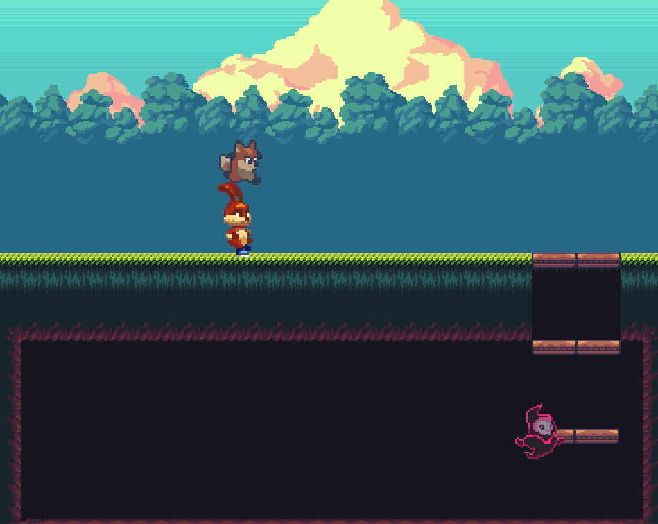

# Pygame Platformer Demo
a basic 2d platformer game, been trying to finish one for years, and i always end up over complicating it.    
i am happy its out of system now :)


# Quick Start
```
    $ pip install -r requirements.txt
    $ python3 main.py
```
# Preview
<center>

</center>